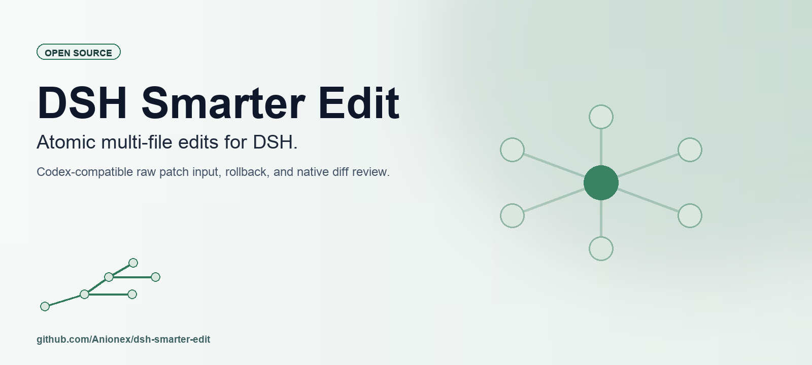

# DSH Smarter Edit

[中文说明](README.zh.md)

[](https://www.npmjs.com/package/@anionex/dsh-smarter-edit)
[](LICENSE)
[](https://github.com/Anionex/dsh-smarter-edit/actions/workflows/ci.yml)
[](https://www.npmjs.com/package/@anionex/dsh-smarter-edit)
[](https://github.com/Anionex/dsh-smarter-edit/releases)

**A better file-editing tool for DeepSeek Harness.**

DSH's native `edit` requires coding models to reconstruct exact source strings
and send both old and new code through structured JSON arguments.

DSH Smarter Edit replaces `edit` with Codex-compatible freeform
`apply_patch`, allowing the model to express code changes directly as a diff.
Its goal is to reduce editing failures and token overhead created by the editor
protocol itself.

```diff
*** Begin Patch
*** Update File: src/app.ts
@@
-const result = oldMethod(value)
+const result = newMethod(value)
*** End Patch
```

The model describes the change instead of reconstructing an exact
`old_string` / `new_string` pair.

**Let the model spend its tokens on changing code, not satisfying the editor
protocol.**



## Why this exists

Coding models should solve one problem: what code should change. DSH's native
editing protocol adds three more.

### 1. Exact-string reconstruction

Native `edit(file_path, old_string, new_string)` asks the model to regenerate
source it has already read. The `old_string` must match the file:

```text
The model knows the correct code change
        ↓
old_string differs in whitespace, indentation, or characters
        ↓
The edit fails
```

The model chose the code change correctly, but the tool rejects it during
argument matching. Smarter Edit removes the exact-string pair from the
model-facing tool and lets contextual patch hunks locate the change.

### 2. Source duplication

Exact-string editing makes the model output both the existing block and a new
block that often repeats most of it:

```text
old_string = existing source
new_string = mostly the same source + the change
```

A patch expresses the changed lines and only the context needed to locate them:

```diff
 required context
-before
+after
 required context
```

The intended token reduction comes from less repeated old source, less repeated
unchanged source, less JSON escaping, and fewer retries after exact-match
failures. The maintainers will not publish a percentage until controlled A/B
tests produce one.

### 3. Structured JSON overhead

The model must also encode multiline source inside a schema:

```json
{
  "old_string": "...",
  "new_string": "..."
}
```

Quoting, escaping, and the exact-match fields belong to the editor protocol,
not the code change. Freeform `apply_patch` lets the model generate the editing
language itself.

## Evidence from OpenAI

OpenAI moved `apply_patch` to a named freeform tool. Its
[official model guide](https://developers.openai.com/api/docs/guides/latest-model?model=gpt-5.2)
reports that this change reduced `apply_patch` failure rates by **35% in
testing** compared with JSON-formatted function calling.

The result measures `apply_patch` call failures. It does not measure task
success, SWE-bench performance, or token savings. It shows that the input format
of an editing tool measurably affects reliability.

## Evidence of exact-string fragility

Literal replacement succeeds only when `old_string` reproduces the target
exactly. Public Claude Code issue reports show how tabs, line endings, and other
invisible details can turn a valid code change into
`String to replace not found in file`:

- [#13152](https://github.com/anthropics/claude-code/issues/13152) reports tabs
  appearing as spaces in read output, followed by exact-match edit failures.
- [#28831](https://github.com/anthropics/claude-code/issues/28831) reports
  unreliable multiline matching on CRLF files with tab indentation and
  identifies read formatting as one possible cause.
- [#54876](https://github.com/anthropics/claude-code/issues/54876) reports LF
  read output against CRLF file contents.
- [#40471](https://github.com/anthropics/claude-code/issues/40471) reports a
  repeated edit-fail, retry, and Python/Bash fallback cycle on tab-indented
  files.

These reports describe another coding tool and do not establish DSH behavior.
They expose the underlying weakness of literal replacement: the model must
reproduce file details that are unrelated to the intended code change. Any
difference can reject the edit and trigger retries or fallback tools.

## Additional capabilities

Besides changing the editing tool exposed to the model, Smarter Edit supports:

- multiple ordered hunks;
- add, update, move, and delete operations;
- Codex-compatible contextual matching;
- failure-atomic preflight and rollback;
- native DSH diff rendering.

## Install

Install the current npm release into a Desktop Profile:

```sh
dsh plugin --profile desktop add @anionex/dsh-smarter-edit
```

Use `web` or `headless` instead of `desktop` for those Profiles. Restart the
running Profile and create a new Session after installation.

Verify that the bundle is mounted:

```sh
dsh --profile desktop --dump-config | grep tool-apply-patch
```

## How it works

1. The model sends a patch between `*** Begin Patch` and `*** End Patch`.
2. Smarter Edit validates the complete patch, locates each change from its
   context, and applies it through the active DSH sandbox. A handled failure
   rolls back published changes.
3. DSH stores the raw patch and renders the result with its native diff view.

The plugin removes model-visible `edit`, `write`, and legacy
`str_replace_editor` plus their prompt sections while replacement mode is
active. Unloading it restores the original tools.

## Compatibility and limitations

- DSH `>=0.1.1-rc.1 <0.2.0`.
- Node.js `^22.19.0 || >=24.0.0` for package development and direct engine use.
- `desktop`, `web`, and `headless` Profiles.
- Write permission from the active DSH sandbox. `workspace-write` keeps its
  configured boundary; `danger-full-access` can allow absolute and
  parent-relative paths outside it.
- Rollback on handled failures protects file state, not retry cost. If one hunk
  in a large patch fails, the whole patch is rejected and a retry must submit
  the full patch again.
- A broad patch can change or delete several files. Review the requested patch
  and the resulting diff when a change has a large scope.

The project is pre-1.0. Compatibility targets the declared DSH `0.1.x` range;
release verification installs the tarball into a clean Profile.

## Implementation details

See [Implementation Notes](docs/implementation.md) for Codex alignment,
failure atomicity, line-ending behavior, package entry points, and provider
transport.

## Syntax

Supported operations:

```diff
*** Add File: relative/path.ts
+every added line starts with +
*** Delete File: relative/obsolete.ts
*** Update File: relative/current.ts
*** Move to: relative/renamed.ts
@@ optional function or section context
 unchanged context
-removed line
+added line
*** End of File
```

`Move to` is optional. `End of File` anchors its hunk to the file tail. A
pure-addition update hunk appends to the file. Relative paths resolve from the
Session working directory; absolute and parent-relative paths work when the
active DSH sandbox permits them. Repeated file sections run in patch order, so
each operation sees earlier operations in the same call. Add over an existing
file replaces it, matching Codex behavior.

## Configuration

Profile patch values, with defaults:

```yaml
- id: tool-apply-patch
  config:
    replaceNativeEdit: true
```

Set `replaceNativeEdit: false` only when you want `edit`, `write`, and
`str_replace_editor` alongside `apply_patch`. It does not change freeform
transport or transaction behavior.

## Benchmarking

The first planned A/B comparison uses DeepSeek V4 Flash on the same coding
fixtures with native DSH `edit` and DSH Smarter Edit. Each cohort must use the
same prompt, model settings, reasoning effort, sandbox, clean workspace
snapshot, and trial count.

| Metric | Definition |
| --- | --- |
| Mutation calls | File-mutation tool calls before completion |
| Mutation failure rate | Rejected or failed mutation calls / all mutation calls |
| Output tokens | Assistant output tokens for the full task |
| Rounds | Model request steps before the terminal answer |
| First-test pass | First test command exits zero |
| Final success | Every fixture acceptance check passes |
| Wall time | User request accepted to terminal result |

Reject a trial from the freeform cohort if the recorded provider request
describes `apply_patch` as `type: "function"`. A valid trial must show OpenAI
`type: "custom"` with `format.syntax: "lark"`. Publish measured results here
only after repeated controlled trials.

## Development

```sh
pnpm install --frozen-lockfile
pnpm peers check
pnpm run check
```

The test suite covers the official Codex corpus, parser and matcher behavior,
sandbox paths, preflight isolation, rollback faults, cleanup, concurrent
modification detection, tool registration, native-tool filtering, package
layout, raw DSH call reconstruction, native diff presentation, and captured
OpenAI request serialization.

Read [CONTRIBUTING.md](CONTRIBUTING.md) before changing behavior or packaging.

## Security and community

- Report vulnerabilities privately through [SECURITY.md](SECURITY.md).
- Get usage help through [SUPPORT.md](SUPPORT.md).
- Propose changes through [CONTRIBUTING.md](CONTRIBUTING.md) and the
  [issue tracker](https://github.com/Anionex/dsh-smarter-edit/issues).
- Read release history in [CHANGELOG.md](CHANGELOG.md).
- Community participation follows the [Code of Conduct](CODE_OF_CONDUCT.md).

Maintained by [Anionex](https://github.com/Anionex) under the
[MIT License](LICENSE).
